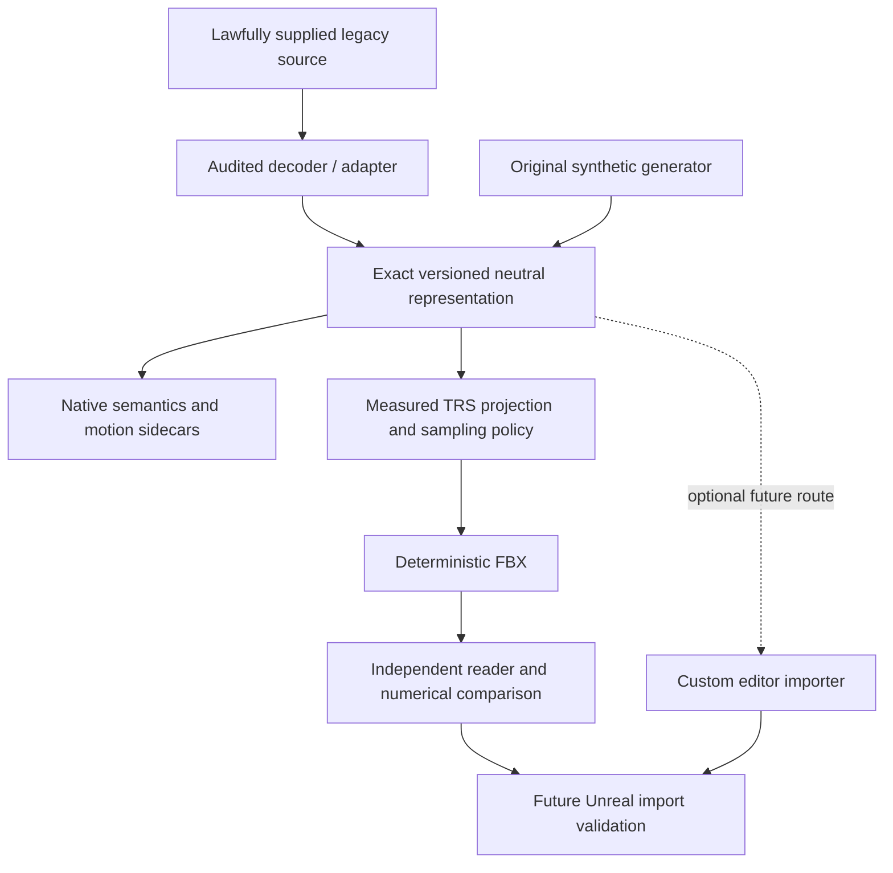

# Legacy GR2 → Unreal Engine Pipeline

**A research-oriented conversion and validation pipeline for legacy Granny-based skeletal assets targeting Unreal Engine.**

This project investigates how to preserve an animated character across a legacy binary decoder, a neutral asset format, an interchange writer and a modern engine. It treats geometry, rig structure, skin weights and animation semantics as measurable contracts. The exact neutral representation remains the source of truth; an exported file is a candidate until an independent reader verifies it.

The public release includes Python tooling, a versioned JSON Schema, an original synthetic corpus, a deterministic ASCII FBX writer and a C harness for independent ufbx readback. The private GR2 decoder integration and game corpus are **not distributed**. Unreal import validation is the next research gate, not a completed feature.

## Why this project exists

Legacy Granny/GR2 assets do not map cleanly onto modern skeletal pipelines. The difficult work is often semantic: preserving skeleton hierarchies and skin bindings, recognizing constant or identity curves, separating local animation from actor movement, and understanding what an interchange format or engine can actually represent.

Development was motivated by research on Metin2-era assets. No game files are included, and this is not an asset distribution or game-package extraction tool. The methods are demonstrated publicly on a small articulated block figure authored entirely in code.

The investigation covers binary format uncertainty, compressed curves, signed/nonuniform scales, full affine transforms versus TRS, reference-pose conventions and interpolation differences. Unsupported data is a reason to stop and investigate, rather than silently substitute a plausible pose.

## Architecture



The public executable path starts at the synthetic generator or a conforming neutral JSON file. The legacy decoder box describes the research architecture; it is not a bundled CLI capability. [Architecture](docs/architecture.md) · [Pipeline](docs/pipeline.md) · [Neutral specification](schemas/README.md).

## Technical highlights

These are **aggregated private-corpus measurements**, provided as research results. The source corpus, original hashes, geometry and animation samples are not shipped. Public CI does not reproduce these private numbers.

| Private validation metric | Observed result |
| --- | ---: |
| Preserved skeleton | 75 bones, original hierarchy |
| Geometry | 2,207 vertices / 2,268 triangles |
| Preserved active skin influences | 3,238 |
| Independent round-trip skin-weight error | 0 |
| Wait: maximum skinned-vertex error | approximately 0.0101 cm |
| Run: maximum skinned-vertex error | approximately 0.3083 cm |
| Run: maximum local orientation error | approximately 0.4218° |
| Maximum vertex error attributable specifically to omitted local off-diagonal S | approximately 0.00000448 cm |

Those finite-sample numerical thresholds passed. A stricter **lossless affine preservation** gate did not: tiny off-diagonal terms were omitted by the active TRS representation. A subsequent controlled comparison isolated their geometric contribution from the much larger interpolation differences. This distinction led to the hybrid architecture, not a claim of mathematical equality. [Validation methods and limitations](docs/validation.md).

The **public synthetic corpus is different**: 48 vertices, 72 triangles, 7 bones, 68 active influences and two original clips. It includes explicit identity/constant channels, a retained attachment joint, negative/nonuniform scaling, artificial tiny shear and unbound motion metadata. Everything is reproducible from [the generator](tests/synthetic/generate.py).

## Key engineering problems addressed

1. **Legacy identity curves:** distinguish an explicitly encoded identity record from a parser returning no data.
2. **Absent versus default:** retain unresolved markers and require evidence before using rest/default components.
3. **Locomotion ownership:** preserve local skeletal bounce without double-applying descriptor or actor movement.
4. **Neutral source of truth:** store full affine transforms, hierarchy, binds, weights and native channel metadata separately from projected derivatives.
5. **Independent validation:** compare the writer's output through a different parser, including evaluated skinning rather than only file structure.
6. **Representation limits:** measure off-diagonal-only removal separately from FBX interpolation and future engine behavior.
7. **Evidence-driven architecture:** use standard gameplay assets where measured fidelity supports them; reserve a custom importer/deformer for a demonstrated need.

Some of these findings came from the private investigation; their general rules are documented here. Public tests exercise the corresponding synthetic contracts, not a universal GR2 decoder. [Animation semantics](docs/animation-semantics.md) · [Development history](docs/development-history.md).

## Try the public pipeline

Requires Python 3.13+ and Git. The optional independent reader build also requires CMake and a C compiler. Create an isolated Python environment, activate it, then:

```sh
python -m pip install -r requirements-dev.txt
python -B -m tests.synthetic.generate --check
python -B -m tools.legacy_pipeline inspect examples/synthetic_asset/neutral.json
python -B -m tools.legacy_pipeline validate-neutral examples/synthetic_asset/neutral.json
python -B -m tools.legacy_pipeline audit-transform examples/synthetic_asset/neutral.json
python -B -m unittest discover -s tests/unit -v
```

The writer refuses nonzero local shear by default. For the explicitly artificial shear in this fixture:

```sh
python -B -m tools.legacy_pipeline write-fbx examples/synthetic_asset/neutral.json --output .local/demo/stride.fbx --clip stride --allow-trs-projection --max-shear 0.000001
python -B tools/build_reader.py
```

The build script acquires three exact, hash-checked public ufbx source/notice files into an ignored local directory and compiles them. It does not download a prebuilt converter. On Linux, validate with:

```sh
python -B -m tools.legacy_pipeline validate-fbx examples/synthetic_asset/neutral.json --fbx .local/demo/stride.fbx --reader .local/reader-build/ufbx_audit --workdir .local/demo/readback --clip stride
```

With the default Windows Visual Studio generator, use `.local/reader-build/Release/ufbx_audit.exe` for `--reader`. Set `UFBX_AUDIT` to that executable and `REQUIRE_UFBX=1` before running the test suite to require independent integration coverage. Without it, the integration test explicitly skips; the configured CI job requires it.

The public writer supports one mesh-space reference convention, diagnostic color materials and the schema's sampled interpolation policy. It does not reconstruct source materials, decode GR2, export glTF, retarget, bake actor motion or import into Unreal. See [current scope](docs/pipeline.md) before using external neutral data.

## Validation philosophy

**Never treat “file exported successfully” as proof of fidelity.** Validate topology, bone names and hierarchy, reference/inverse binds, every influence, durations, local and component/world poses, skinned vertices and attachment frames. Check endpoints and times between keys. Keep source, projected, re-imported and engine results separate.

Tests include deliberately invalid hierarchy, wrong weights, lost tracks, unsupported channels, false identity claims, fixture drift, non-finite values and altered FBX bone names. CI uses only synthetic/public data and does not require Unreal. No hosted CI badge is shown before a hosted run exists.

## Unreal strategy

Use a **hybrid pipeline**: exact neutral data is authoritative; standard UE assets are generated derivatives with their own validation gate. Standard skeletal tracks store translation, quaternion rotation and scale, so an editor importer alone cannot add arbitrary shear to that representation. [Epic track API](https://dev.epicgames.com/documentation/en-us/unreal-engine/API/Runtime/Engine/FRawAnimSequenceTrack).

Measure actual UE local/component transforms and final skinning before deciding whether FBX, a direct importer or a custom deformation path needs work. Avoid extra helper rigs or cinematic caches solely for tiny numerical residuals. [Unreal strategy](docs/unreal-strategy.md).

## Repository contents

| Path | Purpose |
| --- | --- |
| `docs/` | Architecture, binary-format methodology, semantic findings, validation and engine strategy |
| `tools/legacy_pipeline/` | Public neutral CLI, affine math, semantic checks, FBX writer and round-trip comparison |
| `tools/ufbx_audit.c` | Project-owned C harness for the separately acquired independent reader |
| `tools/build_reader.py` | Pinned upstream acquisition and local compilation |
| `tools/publication_guard.py` | Whole-workspace and staged-blob publication checks |
| `schemas/` | Generic public neutral schema and conventions |
| `tests/synthetic/` | Original procedural fixture generator |
| `tests/unit/` | Semantic, mathematical, publication and independent integration tests |
| `tests/fixtures/` | Fixture policy; negative examples are built in memory |
| `examples/synthetic_asset/` | Reproducible original neutral JSON; no external asset data |
| `.github/` | Synthetic CI workflow and contribution templates |
| `PUBLICATION_AUDIT.md`, `PUBLICATION_READINESS.md` | Sanitization decisions and local release gate |

## What is not included

No Metin2 assets, proprietary Granny SDK/runtime binaries, game models, original game textures/animations, client/server source or extracted asset packages are included. The only distributed animation/geometry data is the original synthetic fixture. Users must have lawful access and appropriate rights for any external data they process or distribute. This project does not establish those rights and is not affiliated with Webzen, Ymir, Gameforge or Epic. [Notices](NOTICE.md) · [Dependency review](THIRD_PARTY.md).

## Current status and roadmap

Experimental research tooling, not production-ready conversion software. Local synthetic validation is available now; the private-corpus results are historical aggregates; Unreal runtime fidelity remains unverified.

- Unreal Engine import and component-pose validation.
- Broader original synthetic regression cases, especially inherited nonuniform scale.
- Neutral schema evolution and migration rules.
- Expanded CLI diagnostics and deterministic import manifests.
- Material reconstruction research using original/public test data.
- Skeletal asset batch validation with explicit failure isolation.
- Optional neutral-to-Unreal editor importer when measured needs justify it.
- An upgraded/remade test character using an original compatible rig.

Project-owned code and synthetic data are [MIT-licensed](LICENSE). Please read [CONTRIBUTING.md](CONTRIBUTING.md) and [SECURITY.md](SECURITY.md) before submitting data or changes.
